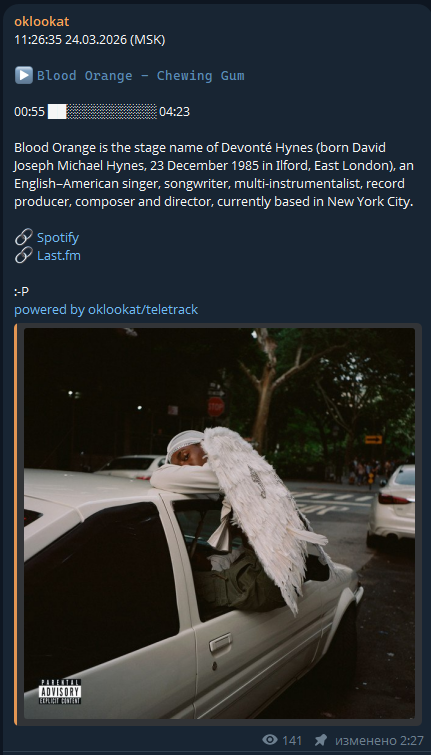

# teletrack

- Показывает трек, который играет в Спотифе, биографию артиста ласт.фм, если она доступна.
Редактирует сообщение в Телеграм-канале.

- Когда ничего не играет, показывает ссылки. Если захотите развернуть бота себе, придется менять код, чтоб вставить свои ссылки.

- Для запуска надо получить токен Спотифая, ласт.фм, и создать ТГ-бота.
