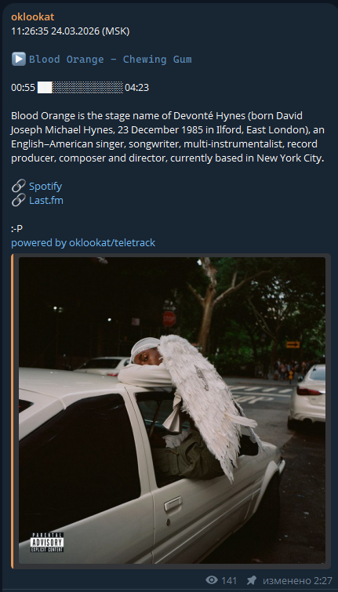

# teletrack

Displays current playing Spotify track in Telegram channel post.

When nothing playing, shows links to my social accounts.

Of course, you want your own links, so you need to modify code to do that (sorry).

## Install

1. Change social links in code and build `teletrack`.
2. Run `teletrack` for first time. `config.json` will be created.
3. Get [last.fm API token](https://www.last.fm/api).
4. Get [Spotify API token](https://developer.spotify.com/dashboard).
5. Create [Telegram Bot](https://t.me/botfather).
6. Fill `config.json`. `telegram`, `lastFm` fields, `spotify` (except `token` field).
7. Run `teletrack`, and authorize `Spotify` (see messages in console).

Automized deployment (to VPS, for example) can be achivied via [ansiblecfgs](https://github.com/oklookat/ansiblecfgs/tree/v2/playbooks/teletrack).
