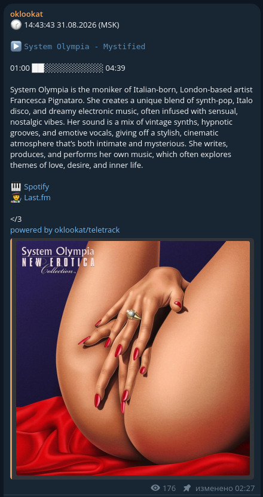
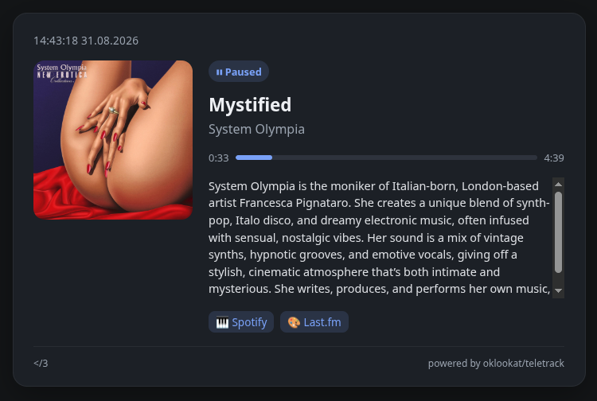

# teletrack

Show what you're listening to from Spotify, Last.fm, or ListenBrainz.

<table>
  <tr>
    <td align="center">
      <br>
      <b><a href="./renderer/telegram">Telegram</a></b>
    </td>
    <td align="center">
      <br>
      <b><a href="./renderer/html">HTML</a></b>
    </td>
  </tr>
</table>

**Outputs**

* Telegram status message
* Responsive HTML status page
* HTTP API + Server-Sent Events

Enable any combination of them.

## Features

* Spotify, Last.fm, and ListenBrainz playback
* Fallback between multiple players
* Artist bios from Last.fm and ListenBrainz
* SQLite cache for bios
* Live Telegram updates
* Responsive HTML UI
* HTTP API with SSE
* TLS support
* Graceful shutdown

## Install

```bash
go install github.com/oklookat/teletrack@latest
```

Or build from source:

```bash
git clone https://github.com/oklookat/teletrack.git
cd teletrack
go build -o teletrack .
```

## Quick start

Run once to create `config.json`:

```bash
./teletrack
```

Then configure the services you use.

### Minimal examples

**Telegram only**

```json
{
  "players": ["spotify"],
  "renderers": ["telegram"],

  "spotify": {
    "redirectURI": "...",
    "clientID": "...",
    "clientSecret": "...",
    "token": {
      "access_token": "...",
      "token_type": "...",
      "refresh_token": "...",
      "expiry": "...",
      "expires_in": 0
    }
  },

  "telegram": {
    "token": "...",
    "userID": 123456789,
    "chatID": "...",
    "serviceChatID": "...",
    "messageID": 123
  }
}
```

**HTML only**

```json
{
  "players": ["spotify"],
  "renderers": ["html"],

  "spotify": {
    "redirectURI": "...",
    "clientID": "...",
    "clientSecret": "...",
    "token": {
      "access_token": "...",
      "token_type": "...",
      "refresh_token": "...",
      "expiry": "...",
      "expires_in": 0
    }
  },

  "html": {
    "addr": "127.0.0.1:8787"
  }
}
```

**API only**

```json
{
  "players": ["spotify"],
  "renderers": ["api"],

  "spotify": {
    "redirectURI": "...",
    "clientID": "...",
    "clientSecret": "...",
    "token": {
      "access_token": "...",
      "token_type": "...",
      "refresh_token": "...",
      "expiry": "...",
      "expires_in": 0
    }
  },

  "api": {
    "addr": "127.0.0.1:8790"
  }
}
```

The complete schema is in [`config.schema.json`](./config.schema.json).

## Sources

### Players

`players` defines where playback is read from:

```json
{
  "players": ["spotify", "lastFm", "listenBrainz"]
}
```

Players are tried **in the configured order**. The first working source provides the current track.

Available players:

| Player         | Required config |
| -------------- | --------------- |
| `spotify`      | `spotify`       |
| `lastFm`       | `lastFm`        |
| `listenBrainz` | `listenBrainz`  |

Only configure the services you use.

### Spotify

Create an app in the [Spotify Developer Dashboard](https://developer.spotify.com/dashboard).

Required:

* `clientID`
* `clientSecret`
* `redirectURI`
* OAuth `token`

For the initial authorization, set:

```json
{
  "spotify": {
    "authorize": true
  }
}
```

Run teletrack and open the authorization URL printed in the console.

After authorization, the token is saved to `config.json`. Set `authorize` back to `false` for normal operation.

### Last.fm

Create an API key at [Last.fm](https://www.last.fm/api).

```json
{
  "lastFm": {
    "apiKey": "...",
    "username": "..."
  }
}
```

Last.fm can be used as a player, a bio source, or both.

### ListenBrainz

Use your ListenBrainz username and token:

```json
{
  "listenBrainz": {
    "username": "...",
    "token": "..."
  }
}
```

ListenBrainz can be used as a player, a bio source, or both.

## Artist bios

`bios` defines the services used to find artist biographies:

```json
{
  "bios": ["lastFm", "listenBrainz"]
}
```

They are tried in the configured order.

Available sources:

* `lastFm`
* `listenBrainz`

If you don't need artist bios, omit `bios`.

## Outputs

`renderers` controls what teletrack publishes:

```json
{
  "renderers": ["telegram", "html", "api"]
}
```

Every combination is valid.

| Output     | Purpose                             |
| ---------- | ----------------------------------- |
| `telegram` | Updates one Telegram status message |
| `html`     | Serves the built-in status page     |
| `api`      | Serves the API without a UI         |

### Telegram

Requires:

* Bot token
* Your Telegram user ID
* Status chat ID
* Service chat ID
* Status message ID

Typical setup:

1. Create a bot with [@BotFather](https://t.me/botfather).
2. Start the bot and send it a private message.
3. Get your user ID and service chat ID.
4. Put them into `config.json`.
5. Set `chatID` and `messageID` to the message teletrack should update.

The renderer edits one message instead of sending a new message for every track.

See [`renderer/telegram`](./renderer/telegram).

### HTML

The HTML renderer serves the status page and its API on the same server.

```json
{
  "renderers": ["html"],
  "html": {
    "addr": "0.0.0.0:8787",
    "apiPathPrefix": "/api/v1/teletrack"
  }
}
```

Default address:

```text
127.0.0.1:8787
```

For remote access, bind to a public interface, for example:

```text
0.0.0.0:8787
```

For HTTPS, set both:

```json
{
  "tlsCertFile": "/etc/teletrack/fullchain.pem",
  "tlsKeyFile": "/etc/teletrack/privkey.pem"
}
```

Or leave them empty and terminate TLS in a reverse proxy.

The page is responsive and keeps the last known track, cover, and bio while idle.

Embedded API:

```text
GET /api/v1/teletrack/playing
GET /api/v1/teletrack/events
```

See [`renderer/html`](./renderer/html).

### HTTP API

The API is intended for your own frontend, widget, or integration. It has no built-in UI.

```json
{
  "renderers": ["api"],
  "api": {
    "addr": "0.0.0.0:8790",
    "pathPrefix": "/api/v1/teletrack"
  }
}
```

Default address:

```text
127.0.0.1:8790
```

Endpoints:

| Method | Path                   | Description                |
| ------ | ---------------------- | -------------------------- |
| `GET`  | `{pathPrefix}/playing` | Current state as JSON      |
| `GET`  | `{pathPrefix}/events`  | Live state updates via SSE |

Default prefix:

```text
/api/v1/teletrack
```

Example:

```js
const es = new EventSource(
  "https://track.example/api/v1/teletrack/events"
);

es.addEventListener("state", (event) => {
  const state = JSON.parse(event.data);
  console.log(state.track, state.idle);
});
```

For a frontend hosted on another domain, configure CORS:

```json
{
  "api": {
    "cors": {
      "allowedOrigins": ["https://example.com"]
    }
  }
}
```

TLS works the same way as for HTML: provide both certificate and key, or use a reverse proxy.

See [`renderer/api`](./renderer/api).

### HTML + API together

You can enable both:

```json
{
  "renderers": ["html", "api"]
}
```

They share the same playback state and SSE stream.

The HTML server exposes the API on its own address, while the standalone API server exposes it on the API address.

## Configuration

Configuration can come from JSON and environment variables.

**Priority:**

1. Environment variables
2. Config file
3. Built-in defaults

### Config file

Teletrack checks these paths in order:

1. `-c <path>`
2. `./config.json`
3. `$HOME/.teletrack/config.json`
4. `/etc/teletrack/config.json`

Example:

```bash
./teletrack -c /etc/teletrack/config.json
```

### Environment variables

Every JSON field can be overridden with an environment variable using the `TELETRACK_` prefix.

Nested fields are flattened with underscores and uppercased:

```text
telegram.token       → TELETRACK_TELEGRAM_TOKEN
telegram.chatID      → TELETRACK_TELEGRAM_CHATID
spotify.clientID     → TELETRACK_SPOTIFY_CLIENTID
players              → TELETRACK_PLAYERS
renderers            → TELETRACK_RENDERERS
```

Arrays are comma-separated:

```bash
TELETRACK_PLAYERS=spotify,lastFm
TELETRACK_BIOS=lastFm
TELETRACK_RENDERERS=telegram,html
```

Example:

```bash
TELETRACK_RENDERERS=html,api
TELETRACK_HTML_ADDR=0.0.0.0:8787
TELETRACK_API_ADDR=127.0.0.1:8790
```

### Flags

| Flag | Default             | Description    |
| ---- | ------------------- | -------------- |
| `-c` | config search paths | Config file    |
| `-D` | `./data`            | Data directory |

The data directory contains the SQLite cache and other runtime data.

It can also be set with:

```bash
TELETRACK_DATA=/var/lib/teletrack
```

## Cache

Artist bios are cached in SQLite.

Optional settings:

```json
{
  "cache": {
    "maxEntries": 1000,
    "successTTL": "24h",
    "failureTTL": "5m",
    "cleanupInterval": "1h"
  }
}
```

* `maxEntries` — maximum number of cached entries. `0` means unlimited.
* `successTTL` — lifetime of successful lookups.
* `failureTTL` — lifetime of failed lookups.
* `cleanupInterval` — cleanup frequency.

The cache lives in the configured data directory.

## API state

`/playing` returns the current state.

When idle, the response can still contain the last known track, cover, and artist bio.

Example:

```json
{
  "playing": false,
  "idle": true,
  "track": {
    "id": "...",
    "artist": "Artist",
    "title": "Track",
    "cover_url": "https://...",
    "track_link": "https://...",
    "track_link_service": "Spotify",
    "progress_ms": 30000,
    "duration_ms": 180000
  },
  "artist": {
    "bio": "Short biography...",
    "bio_service": "Last.fm",
    "link": "https://www.last.fm/music/..."
  },
  "time": "2026-08-31T10:00:00Z",
  "updated_at": "2026-08-31T10:00:05Z"
}
```

`/events` uses Server-Sent Events:

```text
event: state
data: {...}
```

## Architecture

```text
sources → core → renderers
           │
           ├─ Telegram
           ├─ HTML
           └─ API
```

The core only depends on interfaces. HTML and API share one API state when both are enabled.

| Package                             | Role                             |
| ----------------------------------- | -------------------------------- |
| `core`                              | Playback loop, bios, cache       |
| `renderer/telegram`                 | Telegram output                  |
| `renderer/html`                     | Status page                      |
| `renderer/api`                      | HTTP API + SSE                   |
| `spotify`, `lastfm`, `listenbrainz` | Music sources                    |
| `cache`                             | SQLite cache                     |
| `loader`                            | Configuration wiring             |
| `config`                            | Configuration loading and saving |

## Development

Requires Go 1.25+.

```bash
go test ./...
```

```bash
go build -ldflags \
  "-X github.com/oklookat/teletrack/shared.Version=$(git describe --tags --always)" .
```

Code style follows the [Uber Go Style Guide](https://github.com/uber-go/guide/blob/master/style.md).

## License

See [`LICENSE`](./LICENSE).
