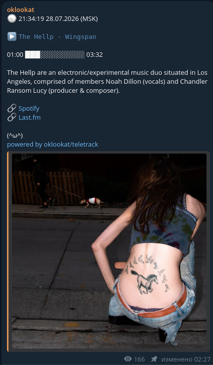

# teletrack

Displays current playing Spotify or Last.fm track in Telegram channel.

## Install

1. Run `teletrack` for first time. `config.json` will be created.
2. Get [last.fm API token](https://www.last.fm/api).
3. Get [Spotify API token](https://developer.spotify.com/dashboard).
4. Create [Telegram Bot](https://t.me/botfather).
5. Fill `config.json`. `telegram`, `lastFm` fields, `spotify` (except `token` field).
6. Run `teletrack`, and authorize `Spotify` (see messages in console).

Automized deployment (to VPS, for example) can be achivied via [ansiblecfgs](https://github.com/oklookat/ansiblecfgs/tree/v3/playbooks/teletrack).

## Flags

`-c`: path to config file. Default: `config.json`.
